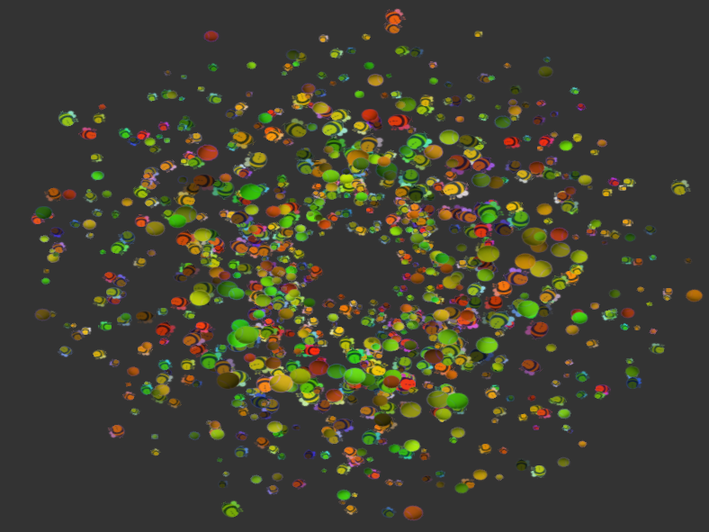

# GameEngine

A modular 2D game engine written in C++ using an archetype-based ECS (Entity Component System) architecture.



## Features

- 2D rendering pipeline (OpenGL)
- Archetype ECS for fast iteration

## Dependencies

Included as Git submodules:

- [GLFW](https://www.glfw.org/)
- [Glad](https://glad.dav1d.de/)
- [SpdLog](https://github.com/gabime/spdlog)
- [stb](https://github.com/nothings/stb)

## Build

```bash
git clone --recurse-submodules https://github.com/TimosPal/GameEngine.git
cd GameEngine
mkdir build && cd build
cmake ..
make
