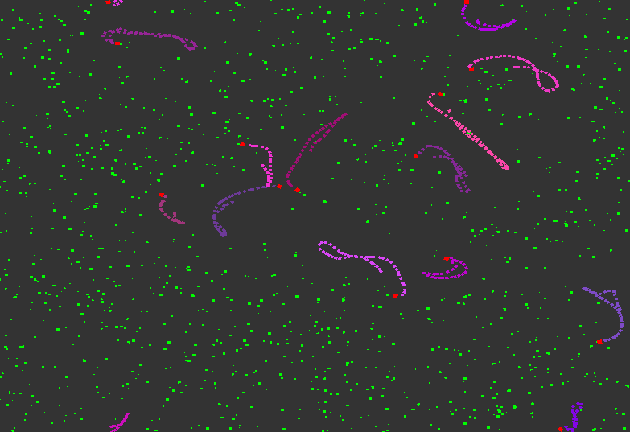

# GameEngine

A modular 2D game engine written in C++ using an archetype-based ECS (Entity Component System) architecture.



## Features

- Input support (Mouse / Keyboard)
- Event based communication (Engine and custom types)
- Layer stack
- 2D rendering pipeline (OpenGL)
- Debugging graphics
- Archetype based ECS for fast entity / component iteration
- Collision detection system
- Resource management
- Tilemaps

## Dependencies

- [GLFW](https://www.glfw.org/) - Window/context/input
- [Glad](https://glad.dav1d.de/) - OpenGL loader
- [SpdLog](https://github.com/gabime/spdlog) - Logging
- [stb](https://github.com/nothings/stb) - Image loading
- [glm](https://github.com/g-truc/glm) - Math library
- [FastNoiseLite](https://github.com/Auburn/FastNoiseLite) - Noise generation

## Getting Started

- All dependencies are included as submodules.
- See `sandbox/src` for sample projects.

## Build

```bash
git clone --recurse-submodules https://github.com/TimosPal/GameEngine.git
cd GameEngine
mkdir build && cd build
cmake ..
make
```